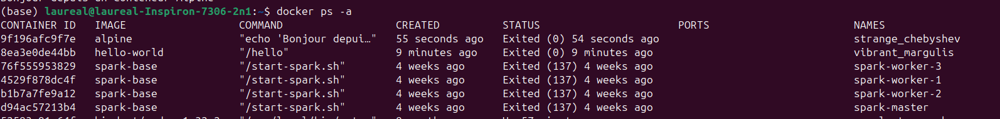
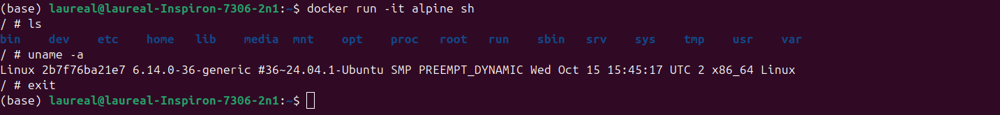
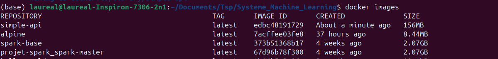
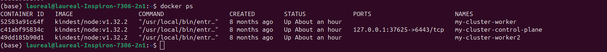
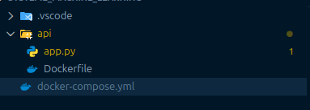
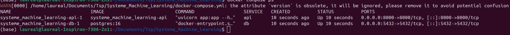
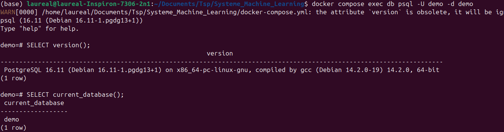
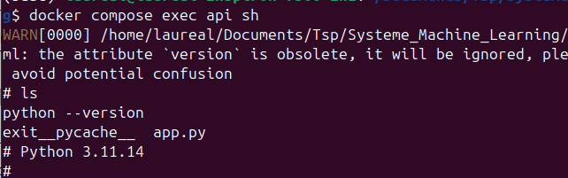
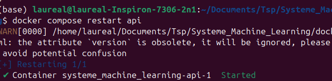
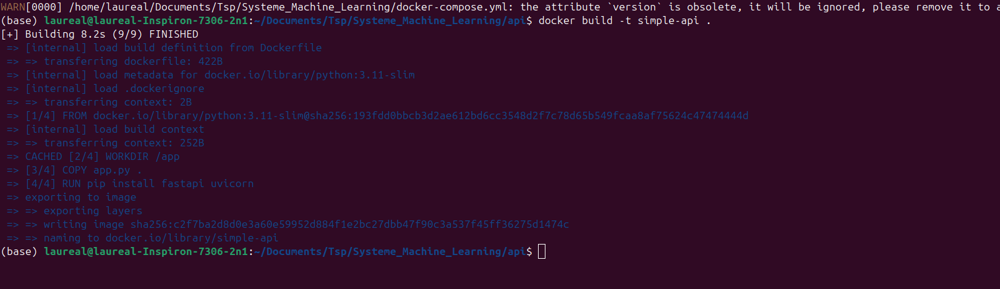

­TP Docker
Exercice 1 
Question 1.b­

Question 1.c

Exercice 2
Question 2.a
Une image est le modèle sur lequel va se baser le conteneur pour tourner. C’est un framework qu’on utilise pour lancer des conteneurs similaires.
Question 2.b

Question 2.c

Question 2.d

Exercice 3
Question 3.a
# app.py
# TODO: importer FastAPI
from fastapi import FastAPI

# TODO: créer une instance FastAPI
app = FastAPI()

# TODO: définir une route GET /health
@app.get("/health")
def health():
   return {"status": "ok"}

Question 3.b
# Dockerfile
# TODO: choisir une image de base Python
FROM python:3.11-slim

# TODO: définir le répertoire de travail dans le conteneur
WORKDIR /app

# TODO: copier le fichier app.py
COPY app.py .

# Installer FastAPI et Uvicorn
RUN pip install fastapi uvicorn

# TODO: lancer le serveur au démarrage du conteneur
CMD ["uvicorn", "app:app", "--host", "0.0.0.0", "--port", "8000"]

Question 3.c

Exercice 4
Question 4.a

La partie de la commande -p 8000:8000 permet de lier le port ouvert du conteneur au port local de notre machine pour pouvoir se connecter au « site/app » que nous venons de créer.
Question 4.b

Question 4.c

Question 4.d

docker ps -a permet de voir tous les conteneurs que nous avons déjà lancé, l’historique des lancements un peu. Alors que docker ps affiche les conteneurs actuels.

Exercice 5
Question 5.a

Question 5.b

version: "3.9"

services:
db:
image: postgres:16
environment:
# TODO: définir l'utilisateur, le mot de passe et le nom de la base
POSTGRES_USER: demo
POSTGRES_PASSWORD: demo
POSTGRES_DB: demo
ports:
# TODO: exposer le port PostgreSQL vers l'hôte
- "5432:5432"

api:
# TODO: construire l'image à partir du Dockerfile dans ./api
build: ./api
ports:
# TODO: exposer le port 8000 du conteneur vers l'hôte
- "8000:8000"
depends_on:
# TODO: indiquer que l'API dépend de la base de données
- db

Question 5.c

Question 5.d

Question 5.e
docker compose down arrête tous les conteneurs associer à notre docker compose alors que docker stop arrete un conteneur que nous indiquons explicitement mais pas l’ensemble du réseau.

Exercice 6
Question 6.a
exec permet d’executer une commande dans un conteneur activ 
db est le nom du service où nous souhaitons lancer la commande
-U permet d’indiquer le nom de l’utilisateur postgreSQL
-d indique la base de données à laquelle nous souhaitons nous connecter

Question 6.b

Question 6.c
Grâce au code que nous allons stocker dans notre service, il est possible de se connecter comme nous venons de le faire.
Le hostname va définir le service à utiliser au sein du compose, le port est le port ouvert indiqué dans notre fichier docker-compose.
L'utilisateur sera demo comme précédemment pour l'accès à la base de données, comme le mot de passe et le nom de la base.

Question 6.d
Le -v inclut la suppression des volumes. Cela implique que toutes les données associées au projet sont supprimées.

Exercice 7
Question 7.a

On peut observer l'ensemble des logs que génèrent la vie de notre service.

Question 7.b

J'observe que le conteneur qui fait tourner mon service api possède python.

Question 7.c

Le redémarrage est utile si nous avons changer la configuration du service et que nous voulons la mettre à jour sans toucher au reste de l'architecture.

Question 7.d

On peut voir ici que l'app ne parvient pas à être utiliser car elle est mal déclarée.

Question 7.e
Il est utile de nettoyer régulièrement afin d'avoir des projets propres mais aussi pour faire une économie d'espace disque et éviter que tout soit saturé avec le temps.

Exercice 8
Question 8.a
Les points principaux de pourquoi un jupyter notebook n'est pas adapté au déploiement d'un modèle est qu'il ne permet pas de gérer les versions, ne permet pas de créer des services associés comme une base de données qui nous permet de rendre l'ingestion des données simple. Par ailleurs, docker permet de faire tourner un même projet peu importe la machine sur laquelle on se trouve (environnement, versions, OS...)

Question 8.b
Docker compose permet de gérer, manipuler et lier plusieurs services interconnectés de manière simple et rapide afin d'assurer la reproductibilité et le dynamise du projet.

