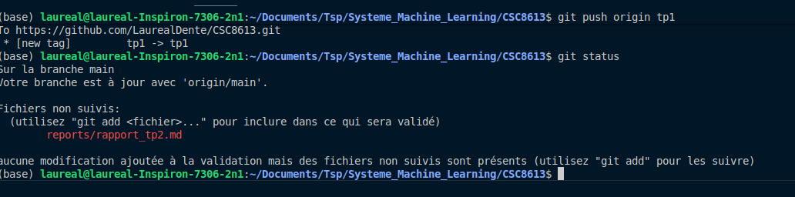
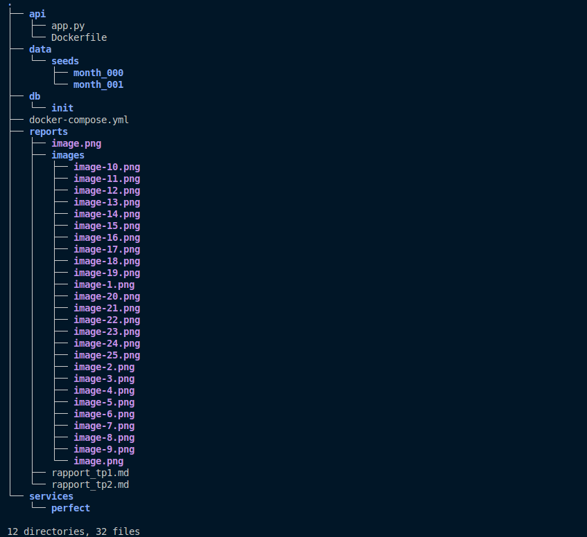
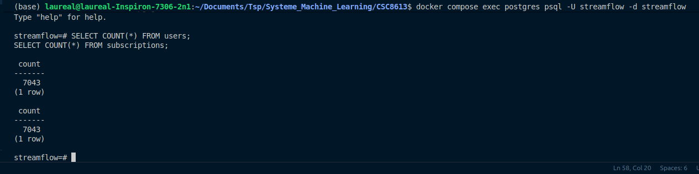
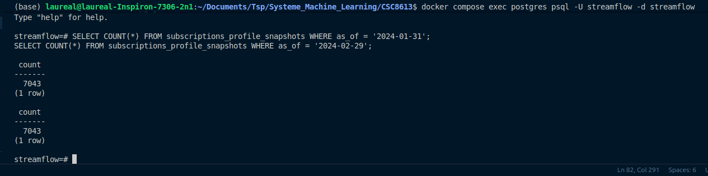

# TP2 – Ingestion mensuelle, validation et snapshots

## 1. Mise en place du projet

### 1.1 État initial du dépôt




### 1.2 Structure minimale ajoutée pour le TP2



### 1.3 Structure des données


## 2. Base de données, .env et docker-compose

### 2.1 Schéma PostgreSQL

Le fichier a été crée : 


### 2.2 Fichier `.env`

Le fichier .env permet de centraliser les variables d’environnement (identifiants, base), éviter de les mettre en dur dans le code ou le docker-compose, et les injecter automatiquement dans les services Docker.


### 2.3 Configuration `docker-compose.yml`


### 2.4 Vérification des tables dans PostgreSQL


La table labels permet de savoir quels clients sont partis et lesquels sont restés. (churn True ou False)
Le payments_agg_90d indique si des paiements ont été refusé lors des 90 derniers jours.
La table subscriptions permet de connaître les détails de paiement des abonnés (comme leur montant, la régularité de paiement ou même le service souscrit)
La table support_agg_90d permet de connaître le nombre de ticket et la durée de résolution reçu sur le service apporté aux clients sur les 90 derniers jours.
La table usage_agg_30d indique l'utilisation que fait le client de son abonnement.
Users contient des informations spécifique au client (Sexe, Age...)

## 3. Upsert des CSV avec Prefect (month_000)

### 3.1 Service Prefect

Le conteneur prefect permet de créer des pipelines et automatisation la partie ingestion des données.

### 3.2 Fonction `upsert_csv` – complétions

  La fonction crée une table temporaire `tmp_<table>` avec le même schéma que le DataFrame, y insère les données, puis utilise `INSERT ... SELECT ... FROM tmp` avec `ON CONFLICT` sur les clés primaires pour faire un upsert.En cas de conflit sur la clé (ligne déjà présente), les colonnes non-clés sont mises à jour. Cela permet de créer la nouvelle version de la base de données à date. as_of constitue la clef primaire double avec user_id qui va permettre de tracer l'avancée des données.

### 3.3 Lancement de l’ingestion `month_000`




## 4. Validation des données avec Great Expectations

### 4.1  Fonction validate_with_ge
Validate_with_ge permet de garantir la qualité des données que nous allons ingérer. Comme vérifier la non négativité de certaine et garantir leur type.


### 4.2 Rôle de `validate_with_ge` dans le pipeline


### 4.3 Justification des bornes choisies

Ces métriques représentent des durées ou des quantités, qui ne peuvent pas être négatives. Des valeurs < 0 indiqueraient un export incorrect ou une corruption des données.

Cela permet de valider que les données transmises au modèle ne sont pas corrompues.

## 5. Snapshots et ingestion `month_001`

### 5.1 Fonction `snapshot_month(as_of)`

Le rôle de snapshot_mont est de créer les tables de snapshots si besoin, puis copier l’état courant des tables live dans des tables avec écrit `_snapshots` en ajoutant une colonne `as_of` pour figer l’état à une date donnée. Cela permet de reprendre les données exactes qu'on avait à un instant t et éviter le data leakage.

### 5.2 Ingestion de `month_001` et vérification des snapshots



Les deux tables sont égales étant donné que les deux fichiers sont similaires. Il n'y a pas d'utilisateurs supplémentaires entre les deux dates.

### 5.3 Schéma du pipeline (ASCII)

```text
CSV month_000 / month_001
          ↓
      Prefect Flow
          ↓
    Upsert tables live
          ↓
  Validation (Great Expectations)
          ↓
    Snapshots *_snapshots (as_of)
          ↓
Données prêtes pour le training ML
```

Les tables lives changent constamment, ça ne permet pas la reproductibilité car à chaque lancement, de nouvelles données seraient disponible changeant les résultats.
Cela peut aussi intégrer des erreurs de data leakage en ne maîtrisant pas correctement les versions de base de données.

Ici le risque de dataleakage est pratiquement nul car nous choisissons la version de la base de données qui nous convient pour travailler et empêche tout risque de confusion.

Le plus difficile dans la mise en place de l'ingestion est la configuration de prefect avec les autres dockers ainsi que la mise en place de l'upsert, il faut des connaissances en SQL particulière.

J'ai eu des erreurs sur les builds du conteneur prefect notamment sur les chemins dans mon projet. J'avais ajouté deux fichiers month_000, le conteneur ne le trouvait pas ce qui me donnait des erreurs et ne me permettait pas de voir les données sur la base de données. J'ai d'abord travaillé en refaisant des parties avant de trouver que j'avais mis trop de dossiers. J'ai résolu en enquêtant sur l'architecture avec la commande tree.