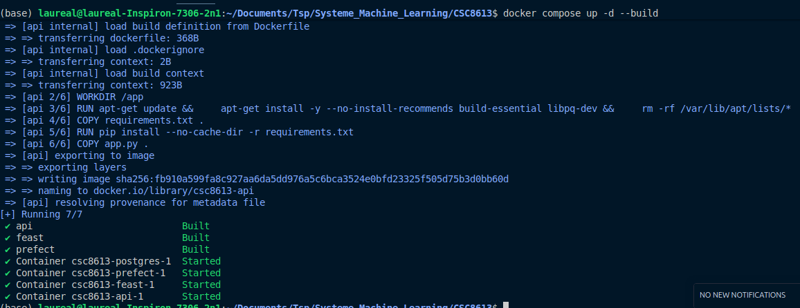
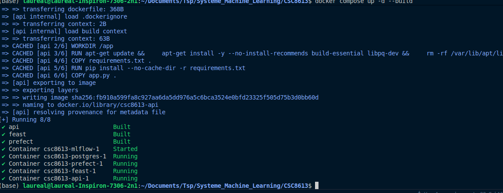
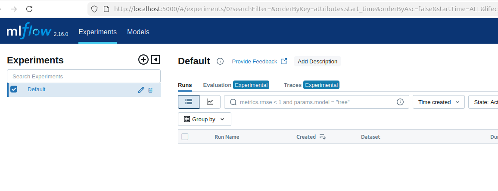
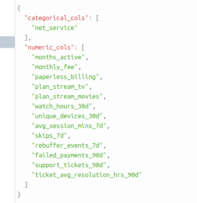
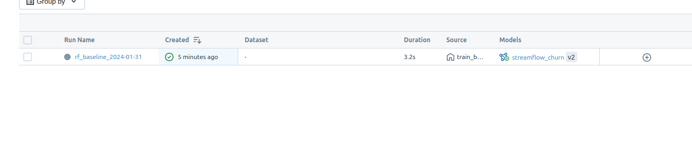
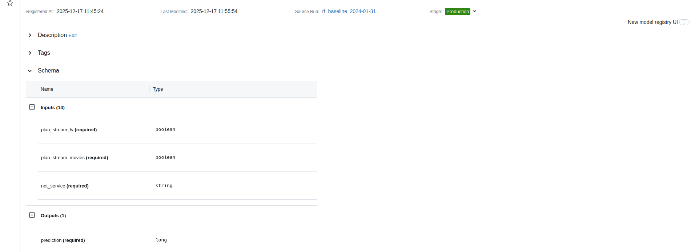
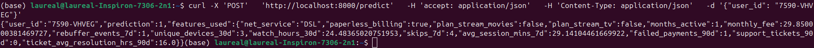

# CI4

## Exercice 1

### Question 1.a

### Question 1.b

### Question 1.c

### Question 1.d

### Question 1.e
docker compose up -d --build
postgres, prefect, feast, api, mlflow
Ce sont l'ensemble des services que nous avons constitué au cours des tps précédents.
postgres : base de données stockant nos données (versionning)
prefect : orchestre les données en snapshot
feast : suprervise la bonne qualité des features
api : service pour échanger avec nos modèles (récupération des données de clients)
mlflow : nouvelle installation pour gérer les versions des modèles

## Exercice 2 
### Question 2.b

### Question 2.c

### Question 2.d
AS_OF permet de reprendre les données du 31 janvier pour éviter le data leakage.
random_state permet de maîtriser la reproducibilité des résulats en obtenant toujours les mêmes splits des données

## Exercice 3
### Question 3.a

### Question 3.c

### Question 3.d

Version 2 : runid 064531f19cec433ab80268a6adf1dd70

### Question 3.e

### Question 3.g
Grâce à l'interface nous gérons mieux les différentes étapes auxquelles sont nos différents modèles. Nous maîtrisons lequel est en production et pouvons contrôler les metrics sélectionnés à tout instant.

## Exercice 4
### Question 4.d

### Question 4.e

{"user_id":"7590-VHVEG","prediction":1,"features_used":{"net_service":"DSL","paperless_billing":true,"plan_stream_movies":false,"plan_stream_tv":false,"months_active":1,"monthly_fee":29.850000381469727,"rebuffer_events_7d":1,"unique_devices_30d":3,"watch_hours_30d":24.48365020751953,"skips_7d":4,"avg_session_mins_7d":29.14104461669922,"failed_payments_90d":1,"support_tickets_90d":0,"ticket_avg_resolution_hrs_90d":16.0}}

### Question 4.g
Le fait de pointer vers le model registry mlflow permet de sélectionner, via une ui, le modele que nous souhaitons avoir en production.
Ce qu'un pointeur vers un .pkl ne permettrait pas car cette méthode serait moins dynamique lors de la manipulation du modèle de production.
C'est à dire que lors d'un changement de modèle pour la production, la seule chose à faire sera d'actualiser le modèle sélectionné du côté de mlflow et tout sera automatisé.

## Exercice 5
### Question 5.a

{"user_id":"7590-VHVEG","prediction":1,"features_used":{"net_service":"DSL","paperless_billing":true,"plan_stream_movies":false,"plan_stream_tv":false,"months_active":1,"monthly_fee":29.850000381469727,"rebuffer_events_7d":1,"unique_devices_30d":3,"watch_hours_30d":24.48365020751953,"skips_7d":4,"avg_session_mins_7d":29.14104461669922,"failed_payments_90d":1,"support_tickets_90d":0,"ticket_avg_resolution_hrs_90d":16.0}}

### Question 5.b

{"error":"Missing features for user_id=9999","missing_features":["net_service","paperless_billing","plan_stream_movies","plan_stream_tv","months_active","monthly_fee","rebuffer_events_7d","unique_devices_30d","watch_hours_30d","skips_7d","avg_session_mins_7d","failed_payments_90d","support_tickets_90d","ticket_avg_resolution_hrs_90d"]}

### Question 5.c
entité absente : le user_id n'est pas présent dans l'online store, ce qui veut dire que le modèle pourrait ingérer des données vides pour un user_id si nous ne faisons pas attention. Ici cette erreur missing_features permet de notifier que le user_id n'existe pas dans l'online store, ou du moins pas encore.
Cet online store peut ne pas être à jour dû à un problème lors du materialize, erreure silencieuse, qui ne met plus à jour la base de données que nous utilisons.
Cette erreur d'entité absente représente donc un indicateur de ce problème.

## Exercice 6
### Question 6.a
Dans ce tp mlflow nous permet de lancer plusieurs versions de l'entraînement d'un modèle, on a pu ajouter ensuite nos propres métriques pour pouvoir "classer" ou évaluer ces différents modèles (f1, auc, accuracy, train_time, dataset_length). Ces données facilitent le choix de la version que nous allons stager en production pour l'utiliser.
Ce stage en production est rendu très simple grâce à l'état disponible dans l'interface mlflow. Ensuite, nous mettons en place une communication avec mlflow pour récupérer automatiquement le modèle que nous avions sélectionné permettant une gestion complète de nos modèles, de l'historique et du lancemeent en production.

### Question 6.b
Pour l'API, le stage production est simplement une catégorie que nous allons chercher pour trouver le modèle qui a été déclaré comme "à utiliser". Une fois le modèle en production identifié le chargement de ce modèle selectionné est possible avec  model = mlflow.pyfunc.load_model(MODEL_URI). 
Cette commande va utiliser la librairie mlflow. Cette librairie mlflow appelle la variable d'environnement MLFLOW_TRACKING_URI=http://mlflow:5000  que nous avons indiqué dans le fichier .env. Grâce à cette mention, le conteneur api sait comment communiquer avec le conteneur mlflow, la communication est ensuite standardisée par la librairie avec /le_nom_du_modele/Production pour trouver le modèle stagé en production.

### Question 6.c
Dans notre TP, l'ensemble de la chaîne de valeur est maîtrisé au niveau de la reproductibilité.
Concernant les données, nous avons mis en place un conteneur postgres qui permet de versionner et retourner facilement à un instant T. Cela permet de réentraîner le modèle sur n'importe quelle version et reproduire le résultat d'un état antérieur.
Concernant le code, chacune des versions est enregistré grâce à github. Les tags sont indiqués ce qui permet de retrouver une version de code précedente facilement.
La configuration quant à elle est indiquée, les librairies ont une version fixée, les random states dans l'entraînement sont aussi fixés ce qui permet de séparer les données chaque fois de la même manière.
L'environnement aussi est fixé grâce au fichier .env qui indique au code les valeurs qu'il doit utilisé, ce fichier est aussi inscrit dans github ce qui permet la reproductibilité.

En bref, la reproductibilité est inscrite dans l'ensemble de la structure de notre TP.