# CI5

## Exercice 1
### Question 1.d
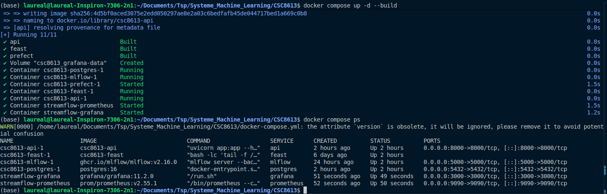

### Question 1.e
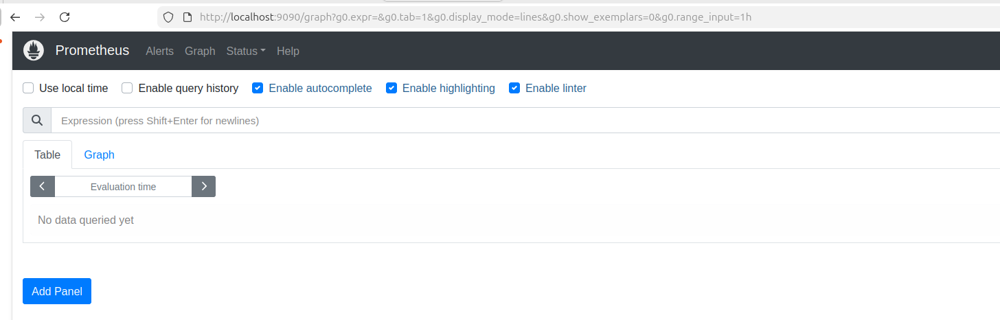
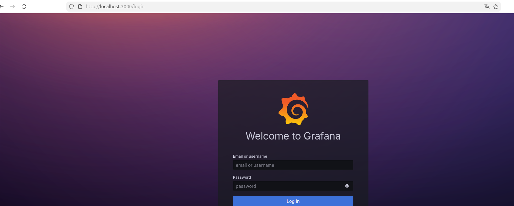

Il communique avec api:8000 et non localhost car c'est un conteneur. Il faut indiquer le service que prometheus doit requêter pour pouvoir stocker ces données.

## Exercice 2
### Question 2.b

on observe bient que le api_request_total est passé de 0 à 1 et le api_request_latency_seconds contient bien des buckets

### Question 2.c
Grâce à l'histogramme, nous pouvons voir les valeurs aberrantes, les différents percentiles et la forme de la distribution. Voir les percentiles sert par exemple à observer dans le temps les latences les plus grandes, en cas de problème ce sera les premières impactées. Les moyennes de leur côté ne permettent pas d'observer cette évolution et cette répartition des latences selon les requêtes.

## Exercice 3
### Question 3.a

On peut voir que la target metrics de l'API est bien UP

### Question 3.b
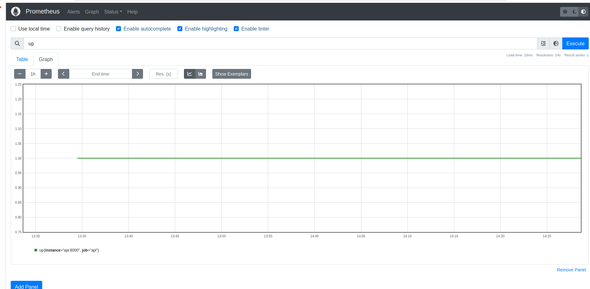
La requête up récupère les APIs se trouvant dans un état up, on voit les données de l'API. Une seule est UP depuis environ 13h35 à l'heure où je fais ce tp.

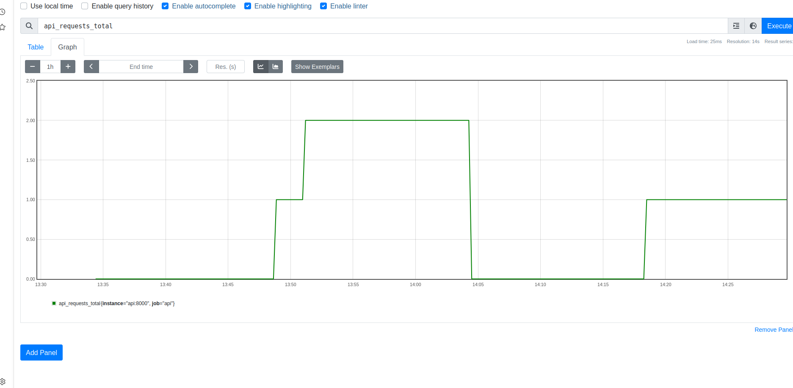
On voit le nombre de requêtes que l'API a enregistré depuis qu'elle est lancée. Démarrée à 13h35 je l'ai relancée une fois autour de 14h05 pour prendre des photos proprement. On voit ensuite que j'ai relancé une requête.

Nous avons des lignes des différentes secondes qu'ont prit les requêtes. Ici nous n'avons qu'une seule requête ce qui fait que seulement les courbes montrant less or equal 0.1 ou supérieur sont à 1 les autres sont à 0 car la requête a prit 0.08 secondes à s'exécuter : 
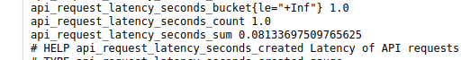

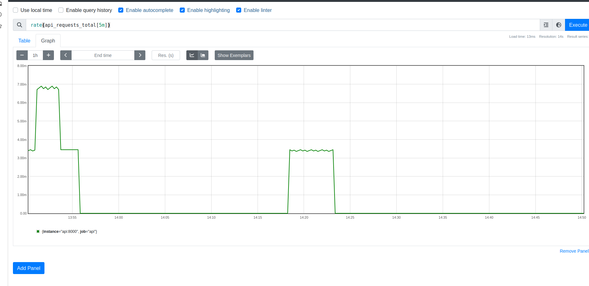
Ici nous observons le nombre de requête aggrégés sur 5 minutes glissantes.

### Question 3.c
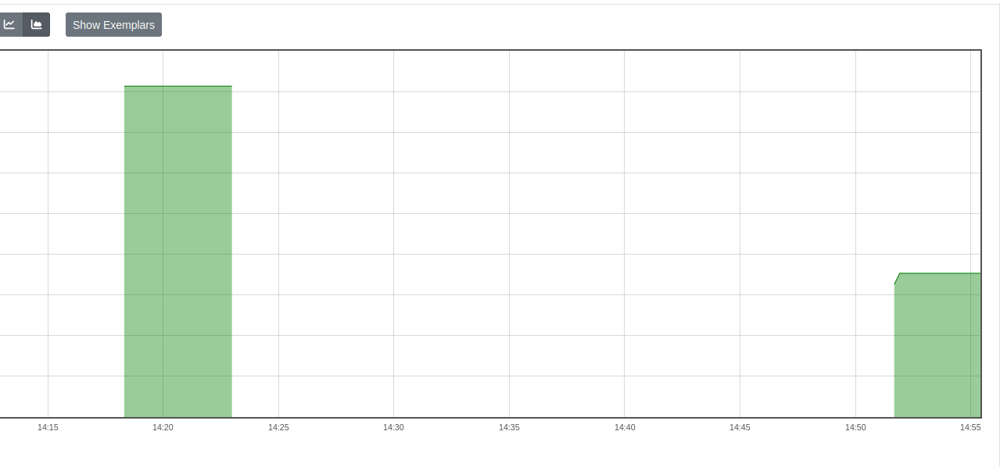
On voit apparaître les moyennes de latences. La somme des latences divisée par le nombre de latences enregistrées sur 5 minutes glissantes.
Plus elle est faible plus l'utilisateur aura une api rapide.

## Exercice 4
### Question 4.a
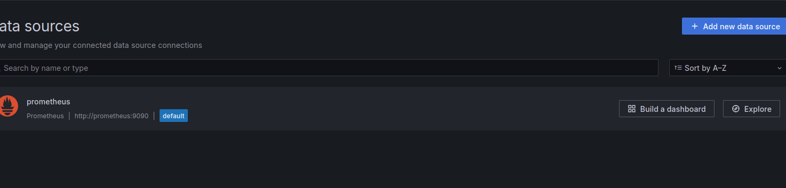

### Question 4.b

### Question 4.c

### Question 4.d
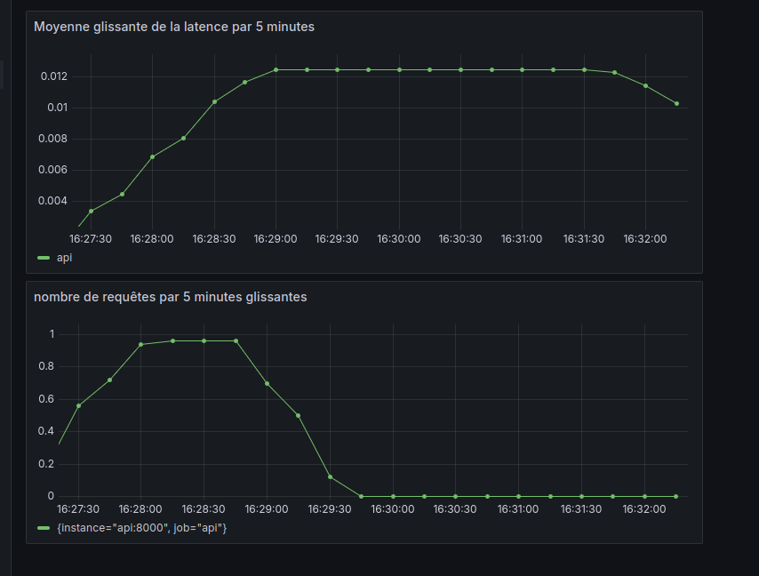
On observe bien les variations dans les courbes de latence et de requêtes par 5 minutes (100 requêtes envoyées avec 1 seconde d'attente)

### Question 4.e
Sur ces métriques nous observons les performances de l'API, si les clients sont bien servis à temps. Grâce à cela nous pouvons être averti lorsque le modèle commence à mettre du temps à calculer la prédiciton et monitorer le modèle.
Dans ce même cas de monitoring nous ne voyons par contre pas la qualité du modèle tel que AUC, l'accuracy ou le F1 par exemple que nous avions vu apparaître sur MLflow.

## Exercice 5
### Question 5.b
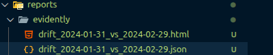
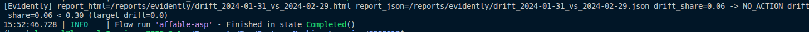
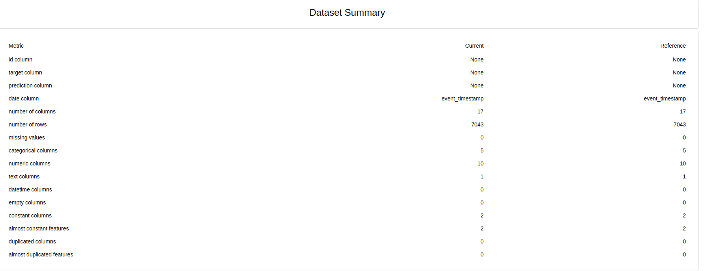
On observe que le current (2024-02-29) et le reference (2024-01-31) ont le même nombre de colonnes.

### Question 5.c
[Evidently] report_html=/reports/evidently/drift_2024-01-31_vs_2024-02-29.html report_json=/reports/evidently/drift_2024-01-31_vs_2024-02-29.json drift_share=0.06 -> NO_ACTION drift_share=0.06 < 0.30 (target_drift=0.0)

covariate drift :
le covariate drift est issus de nos entrées on observe dans la capture au dessus qu'un drift à 0.204991 sur la colonne rebuffer_events_7d a été détecté.

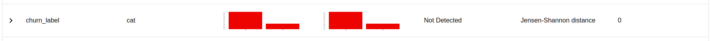
target drift :
le target drift est la mesure de drift sur notre colonne churn_label, notre colonne de prédiction. Dans la capture ci-dessus on n'oberve pas de drift ce qui veut dire qu'il n'y pas de target drift dans notre projet.