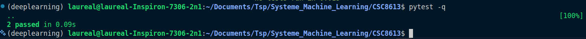

# CI6

## Exercice 1
### Question 1.b

### Question 1.c

## Exercice 2
### Question 2.d

Nous testons une fonction pure afin de s'assurer de son fonctionnement sans dépendance avant l'intégration à une fonction métier.

## Exercice 3 
### Question 3.d

## 