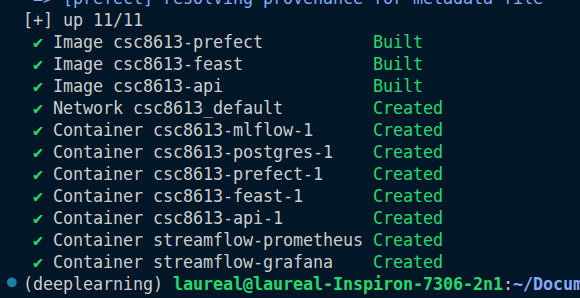
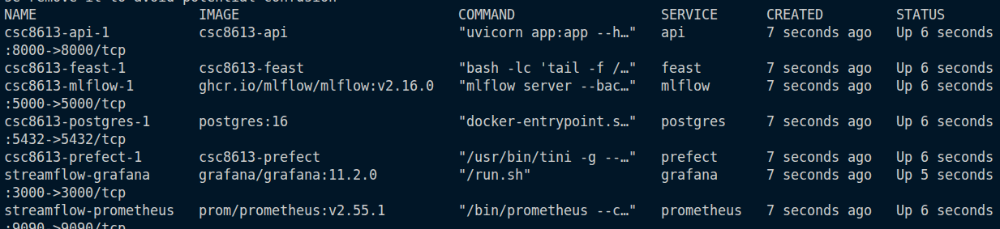
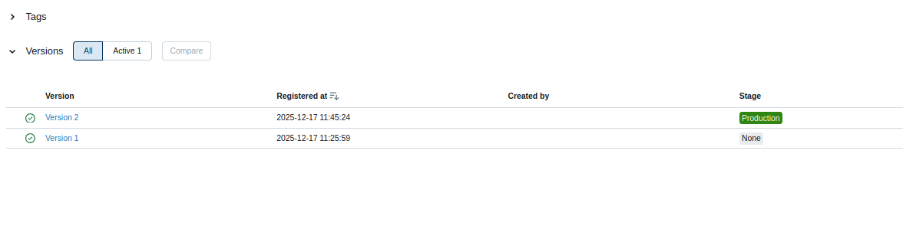
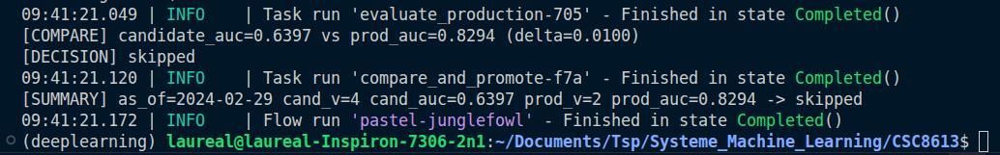
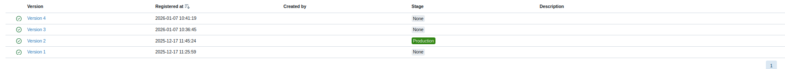
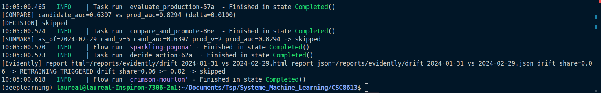
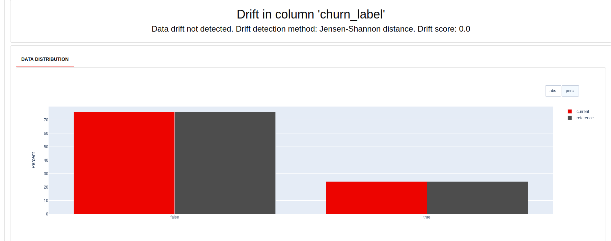
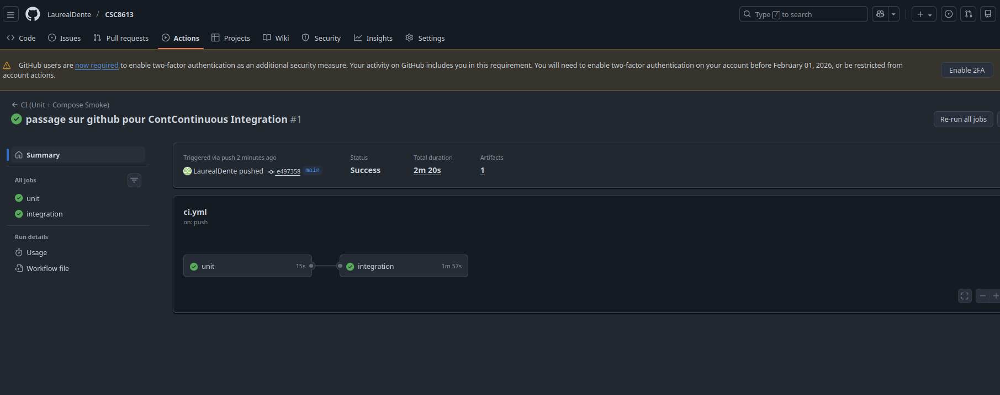

# CI6

## Exercice 1
### Question 1.b





### Question 1.c




## Exercice 2
### Question 2.d


Nous testons une fonction pure afin de s'assurer de son fonctionnement sans dépendance avant l'intégration à une fonction métier.

## Exercice 3 
### Question 3.d





On peut observer que le nouveau modèle n'a pas été promu. (auc trop faible)
Le delta permet de s'assurer de la supériorité du nouveau modèle sur l'ancien en prenant en compte le bruit.

## Exercice 4
### Question 4.c





## Exercice 5
### Question 5.c

```json
{
  "user_id": "5575-GNVDE",
  "prediction": 0,
  "features_used": {
    "plan_stream_movies": false,
    "paperless_billing": false,
    "plan_stream_tv": false,
    "months_active": 34,
    "net_service": "DSL",
    "monthly_fee": 56.95000076293945,
    "unique_devices_30d": 1,
    "avg_session_mins_7d": 29.14104461669922,
    "skips_7d": 6,
    "rebuffer_events_7d": 4,
    "watch_hours_30d": 30.03622817993164,
    "failed_payments_90d": 0,
    "ticket_avg_resolution_hrs_90d": 8.600000381469727,
    "support_tickets_90d": 0
  }
}
```
Ce restart de l'api est important pour que celui-ci prenne en compte le modèle actuellement noté comme en production (ici on a gardé l'ancien car jugé plus performant avec le delta de calcul de l'auc).

## Exercice 6 
### Question 6.c



On peut vérifier grâce à ce démarrage docker compose dans la CI que le projet fonctionne indépendemment de la configuration local de l'ordinateur de travail. Vérifiant ainsi la possibilité de mise en production sans problème.

## Exercice 7
### Question 7.a

Le drift est mesuré grâce à Evidently. Cette librairie permet de mesurer, pour chacune des colonnes de notre dataset, les statistiques. Ces statistiques sont utilisés pour mesurer les drifts. Le seuil dans notre projet est défini à 0.02, très très bas, pour nous permettre d'observer le réentraînement du modèle sur ce projet. Dans des conditions de productions nous devrions augmenter ce drift pour ne pas réentrainer notre modèle à chaque lancement. Lorsque le drift dépasse ce seuil, nous réentrainons le modèle sur de nouvelles données.

La fonction train_and_compare_flow compare val_auc et décide d'une promotion comme ceci. Il déclenche l'entraînement d'un nouveau modèle sur les données les plus récentes. On évalue le modèle que nous avons actuellement en production sur les mêmes données. Les résultats (val_auc) sont comparés en regardant si le nouveau modèle est supérieur en termes de performances au modèle en production (en y ajoutant le seuil définit de bruit dans should_promote par défaut ici 0.01 (hérité du main))

Prefect gère le réentraînement des modèles et leur monitoring au fur et à mesure de sa vie. D'un autre côté GitHub Actions permet de superviser la qualité du code. Si les fonctionnalités logicielles échouent alors le projet ne sera pas déployé. 

### Question 7.b

La CI n'entraîne pas le modèle complet car ça mettrait trop de temps et ce n'est pas son rôle, il doit simplement superviser la qualité des fonctions unitaires et leur intégration minimale. La qualité du modèle est géré par les mesures prefect. Si le code est géré sur tous les environnement alors la logique de qualité du modèle sera la même sur n'import quel système.

Dans ce projet, nous testons simplement au niveau de la continuous integration la logique de promotion. Nous pourrions par exemple tester la logique d'intégration de l'API, les requêtes Postgres, la création des features, l'évaluation correcte

La gouvernance/ L'approbation humaine reste importante en réalité dans le déploiement d'un nouveau modèle car nous ne pouvons pas nous baser sur une seule métrique pour mesurer les performances d'un modèle. Cette métrique ne nous permet pas de connaître l'expérience utilisateur du nouveau modèle. Des concepts plus poussés de déploiement comme le bandits, l'interleaving ou encore le A/B testing permettrait de mieux contrôler le passage final en production.


